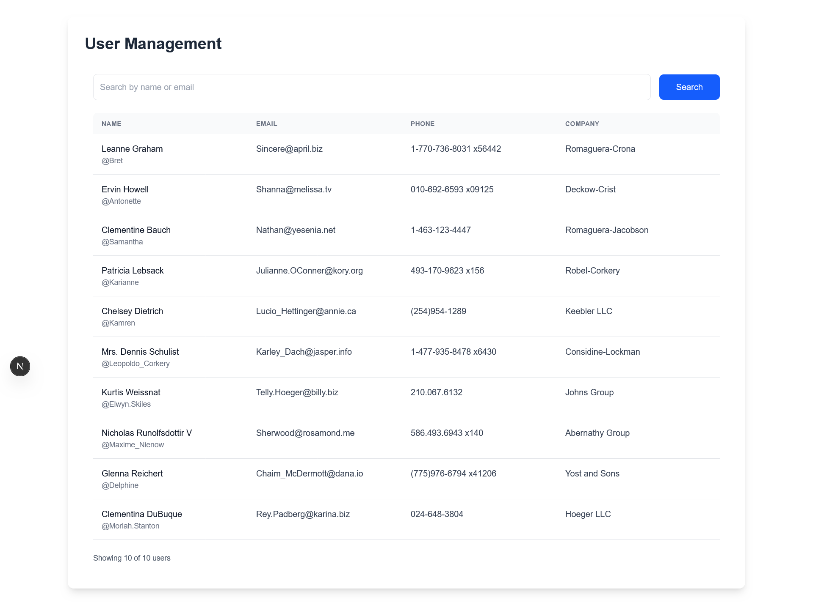
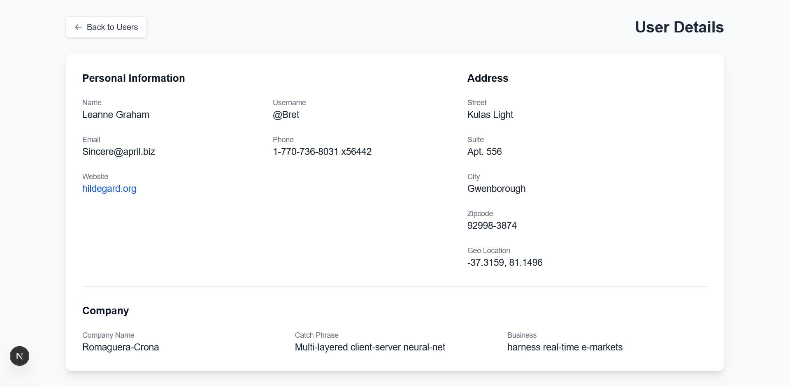

# My Dashboard App

A responsive **Dashboard application** built with **Next.js**, **TypeScript**, **Tailwind CSS**, and **Framer Motion**.  
This project fetches user data from an API and displays it in a searchable, paginated, and responsive list. Clicking a user opens a detailed user page.

---

## Live Demo

🌐 [View Live](https://your-live-site.vercel.app)  

---

## Features

- Fetches user data from JSONPlaceholder API
- **User List Page**
  - Search by **name** or **email**
  - Pagination with **10 users per page**
  - Responsive design for mobile & desktop
  - Animated user cards using **Framer Motion**
- **User Details Page**
  - View detailed info of selected user
  - Smooth navigation between list and details page
- Modern **Tailwind CSS** styling
- Fully typed with **TypeScript**

---

## Screenshots

| User List (Desktop) | User List (Mobile) |
|--------------------|------------------|
|  | .png) |

| User Details |
|-------------|
|  |

---

## Tech Stack

- **Next.js 13 (App Router)**
- **TypeScript**
- **Tailwind CSS**
- **Framer Motion** for animations
- **JSONPlaceholder API** for dummy user data

---

## Installation

1. Clone the repo:

```bash
git clone https://github.com/your-username/my-dashboard-app.git
cd my-dashboard-app
